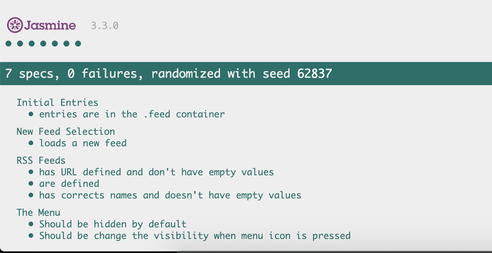

# Project Overview

In this project you are given a web-based application that reads RSS feeds. The original developer of this application clearly saw the value in testing, they've already included [Jasmine](http://jasmine.github.io/) and even started writing their first test suite! Unfortunately, they decided to move on to start their own company and we're now left with an application with an incomplete test suite. That's where you come in.

## How to run this project
- Run this command `git clone https://github.com/cesar18pena/feedreader.git`
- Open `index.html` file and the project start

## Material used to complete this project:
- Udacity course material
- Jasmine and jQuery Documentations
